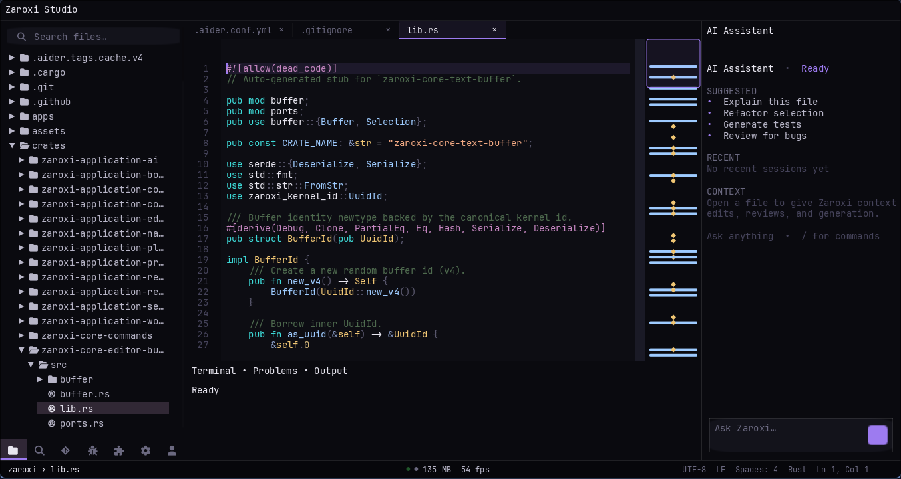

# Zaroxi Studio

**An AI-first, pure-Rust editor and IDE platform with a native, GPU-rendered desktop shell.**

<p align="center">
  
</p>

<p align="center">
  <em>GPU-rendered from scratch — no Electron, no web view.</em>
</p>

[](https://github.com/ZaroxiHQ/zaroxi/actions/workflows/linux.yml)
[](https://github.com/ZaroxiHQ/zaroxi/actions/workflows/macos.yml)
[](https://github.com/ZaroxiHQ/zaroxi/actions/workflows/windows.yml)
[](LICENSE)
[](https://github.com/ZaroxiHQ/zaroxi/stargazers)
[](https://github.com/ZaroxiHQ/zaroxi/commits)

> [!WARNING]
> **Heavily under development** — APIs, features, and architecture may change.
> Early adopters and contributors welcome; expect instability and breaking changes.

> Most AI editors wrap a chatbot around VS Code's Electron shell. Zaroxi renders
> every pixel itself — the editor, the AI cockpit, and the layered 145-crate
> architecture are built for AI-native workflows from the kernel up, not bolted
> on afterward.

Zaroxi Studio is a native code editor built as a layered Rust workspace and drawn
end to end on the GPU (winit · wgpu · vello · cosmic-text). A dedicated
intelligence layer and application-owned AI service ports sit alongside the editor
engine, so AI is part of the architecture rather than an add-on.

## Status at a glance

| Area | Status |
|---|---|
| Core text editing | Working — GPU text rendering, in-memory buffers, transactional edits/undo |
| Large file support | Working — piece-table backend for files ≥ 1 MB |
| Syntax highlighting | Working — Tree-sitter (Rust, TOML, Markdown, Nix, and more) |
| Git integration | In progress — line-level diff engine for gutter/minimap overlays |
| AI cockpit | In progress — panel and context building (backend adapter is currently a mock) |
| LSP support | Planned |
| Extensions / plugins | Planned |
| macOS / Windows builds | CI green; less battle-tested than Linux |

See [`docs/roadmap.md`](docs/roadmap.md) for the fuller picture.

## Why Zaroxi Studio

- **AI-first by design** — a dedicated intelligence layer (agents, planning, context, memory, tools, safety) and application-owned AI service ports, with inline-AI primitives in the editor core.
- **Native, not a web wrapper** — the desktop shell renders entirely through Rust GPU crates; there is no web view, JavaScript runtime, or embedded browser.
- **Crate-first and layered** — strict Kernel → Core → Domain → Application → Interface boundaries keep the engine, orchestration, and UI independently testable.
- **Real editor foundations** — GPU text rendering, buffers with transactions, a piece-table backend for large files, and Tree-sitter highlighting from pinned grammars.
- **Engineered for trust** — `unsafe`-forbidden by policy (`forbid(unsafe_code)`), cross-platform CI, and `cargo-audit` / `cargo-deny` / CodeQL in the pipeline.

## How it compares

| | Zaroxi Studio | VS Code + Copilot | Cursor | Zed |
|---|---|---|---|---|
| Rendering | Native GPU (wgpu) | Electron / Chromium | Electron / Chromium | Native GPU |
| Language | Rust (unsafe-forbidden) | TypeScript + native | TypeScript + native | Rust |
| AI approach | First-class intelligence layer | Extension (Copilot) | Built-in (closed) | Built-in |
| Open source | Yes (MIT) | Partial | No | Yes (GPL) |

This isn't about being "better" in every dimension — it's a different set of
tradeoffs, optimized for AI-native workflows and long-term performance headroom.

## Repository layout

```text
apps/                    # runnable binaries (desktop harness)
crates/
  zaroxi-kernel-*        # IDs, traits, primitives
  zaroxi-core-*          # editor, engine, and rendering
  zaroxi-domain-*        # value objects and models
  zaroxi-application-*   # orchestration and use cases
  zaroxi-interface-*     # desktop shell, GPU draw, layout
  zaroxi-intelligence-*  # agents, planning, context, memory, tools
  zaroxi-infrastructure-* / -security-*
docs/                    # architecture, crate guide, security
tooling/scripts/         # local CI + setup helpers
.github/workflows/       # CI, release, and security automation
```

## Getting started

Prerequisites: a recent stable Rust toolchain (edition 2024). On Debian/Ubuntu,
install the windowing dependencies first:

```bash
sudo apt-get install -y libxkbcommon-dev libwayland-dev
```

### Try it in under a minute

```bash
git clone https://github.com/ZaroxiHQ/zaroxi.git
cd zaroxi
cargo run -p zaroxi-interface-desktop --bin gui_shell
```

The first build compiles the workspace dependency graph and can take a few
minutes; subsequent builds are incremental and fast.

## Development

Run the same gates as CI:

```bash
cargo fmt --all --check
cargo check --workspace --all-targets
cargo clippy --workspace --all-targets -- -D warnings
cargo test --workspace
bash scripts/architecture_check.sh
```

Or run the full pipeline locally in one step:

- Linux/macOS — `tooling/scripts/run-ci-local.sh`
- Windows — `pwsh -File tooling/scripts/run-ci-windows.ps1`

New to the codebase? Start with the [documentation index](docs/README.md), then
[`docs/architecture.md`](docs/architecture.md) and [`docs/development.md`](docs/development.md).

## Contributing

Contributions are welcome. Read [CONTRIBUTING.md](CONTRIBUTING.md) and the
[Code of Conduct](CODE_OF_CONDUCT.md), then open an issue or a pull request. PRs
are auto-labeled and roll up into drafted release notes.

## Good first issues

New to the codebase? These are scoped for a first contribution:

<!-- TODO: these links require the Labels workflow (.github/workflows/labels.yml)
     to have run and matching issues to be filed. Verify the labels exist before
     relying on these links. -->

- [`good first issue`](https://github.com/ZaroxiHQ/zaroxi/labels/good%20first%20issue) — small, well-defined tasks
- [`help wanted`](https://github.com/ZaroxiHQ/zaroxi/labels/help%20wanted) — broader scope, guidance available

<!-- TODO: GitHub Discussions must be enabled in repo Settings for this link to
     resolve; otherwise remove it. -->
Planning a larger change? Open a
[Discussion](https://github.com/ZaroxiHQ/zaroxi/discussions) first — it saves
everyone time.

## Security

Report vulnerabilities privately via a GitHub Security Advisory — see
[SECURITY.md](.github/SECURITY.md). Please don't open public issues for security
reports.

## License

Licensed under the MIT License — see [LICENSE](LICENSE).

## Built with

- [wgpu](https://github.com/gfx-rs/wgpu) — cross-platform GPU access
- [vello](https://github.com/linebender/vello) — GPU 2D vector rendering
- [winit](https://github.com/rust-windowing/winit) — windowing
- [cosmic-text](https://github.com/pop-os/cosmic-text) — text shaping and layout
- [tree-sitter](https://github.com/tree-sitter/tree-sitter) — incremental parsing
- [tokio](https://github.com/tokio-rs/tokio) — async runtime

---

If you're interested in Rust systems programming, GPU rendering, or AI-native
developer tools, star the repo to follow progress — Zaroxi ships fast and its
architecture decisions are documented as they happen.

Forks and PRs are genuinely welcome, especially for:

- Platform-specific testing (macOS, Windows)
- Tree-sitter grammar additions for new languages
- Performance profiling on large codebases
