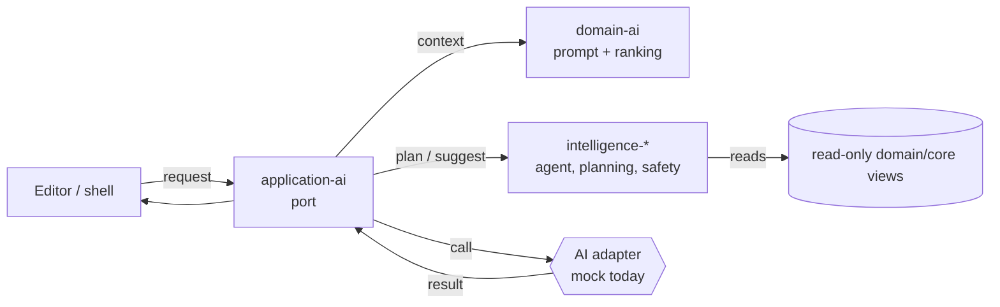

# AI and Editor Flows

How AI is integrated into Zaroxi Studio at the architecture level, and an honest
account of what exists today. See [architecture.md](architecture.md) §6 for the
short version.

## Design intent

AI is a layer, not an extension. The goal is that assistance is expressed through
the same ports and models as the rest of the editor, so the editor talks to an
*interface* rather than a specific vendor, and AI logic stays testable and
swappable.

## Where AI lives

| Concern | Crate(s) |
|---|---|
| AI service **ports** (application-owned traits) + panel view models | `zaroxi-application-ai` |
| Prompt building, context collection, ranking, packing | `zaroxi-domain-ai` |
| Agents, planning, context, memory, tools, safety, embeddings, eval | `zaroxi-intelligence-*` |
| Inline-AI editing primitives in the editor core | `zaroxi-core-editor-inline-ai` |
| Backend adapter (dev/test) | `zaroxi-infrastructure-ai-mock` |

## Interaction model

Key properties:

- The **intelligence** layer works on read-only views and returns
  plans/suggestions; it does not mutate editor state directly.
- All apply-side effects are mediated by **application** use cases, so edits go
  through the same paths (and safety checks) as any other change.
- The model backend is reached through an application **port**, so it can be a
  mock, a local model, or a remote provider without touching the editor.

## Real vs evolving

| Aspect | State |
|---|---|
| Layering, ports, panel view models | Real |
| Context collection, ranking, prompt construction | Real (in `zaroxi-domain-ai`) |
| Intelligence crates (agent/planning/context/…) | Present; capabilities evolving |
| Backend model adapter | Mock only (`zaroxi-infrastructure-ai-mock`) |
| Production apply/review pipeline | Evolving — not complete |

## How this differs from "AI bolted on"

In an extension model, AI sits outside the editor and pokes at it through a public
API. Here the intelligence layer, AI ports, and inline-AI primitives are part of
the crate graph from the start, so context, safety, and apply flows are first-class
concerns rather than afterthoughts. The trade-off is that the architecture is
ahead of the shipped feature set — this doc will track that gap honestly.
