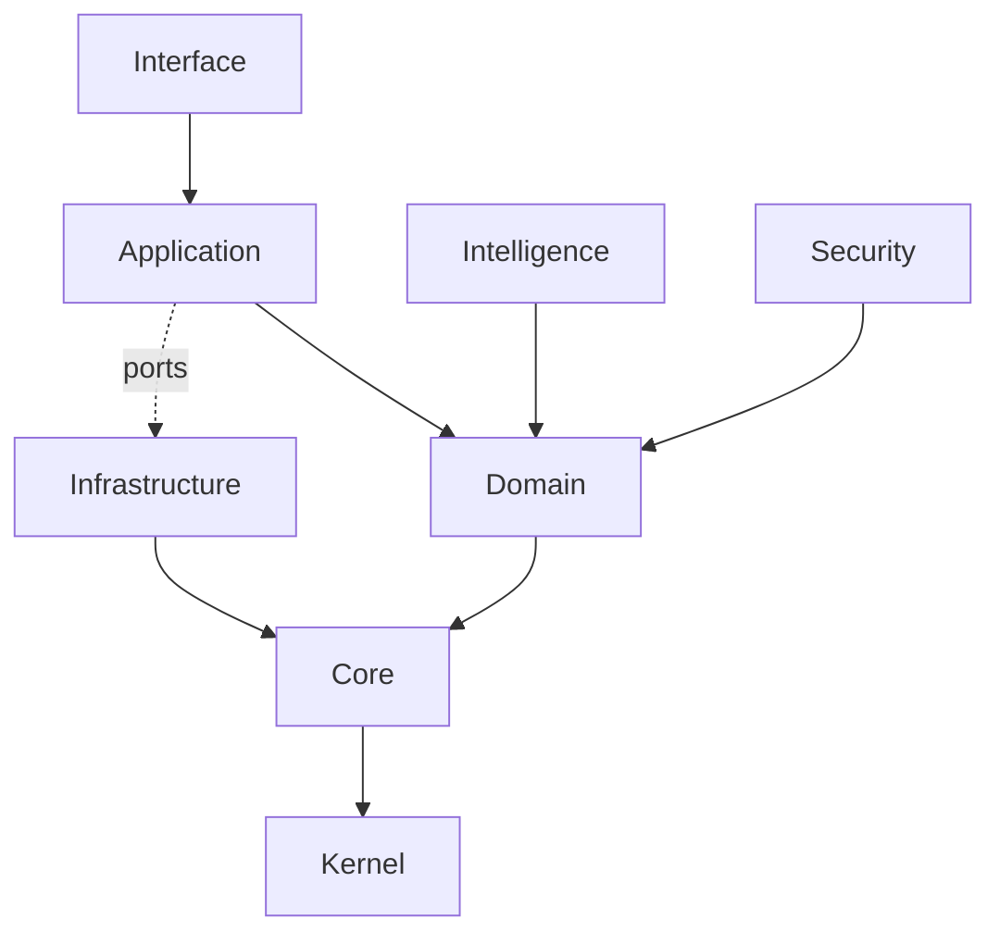

# Architecture

The authoritative architecture document for Zaroxi Studio. It describes the
layer model, dependency rules and how they are enforced, the runtime shape, and
where AI fits. Deeper topics live in focused docs and are linked at the end.

> Scope: this document explains *how the system is structured and why*. It does
> not restate code. Concrete desktop flows live in
> [runtime-and-rendering.md](runtime-and-rendering.md); the crate catalog lives
> in [crates.md](crates.md).

## 1. Overview

Zaroxi Studio is a native, GPU-rendered code editor and IDE runtime written
entirely in Rust. The repository is a single Cargo workspace of ~145 small
crates plus one runnable app (the desktop harness).

The design has three defining choices:

- **Native and pure-Rust.** The desktop shell is drawn end to end with Rust GPU
  crates (winit, wgpu, vello, cosmic-text). There is no web view, JavaScript
  runtime, or Electron/Tauri layer.
- **Crate-first and layered.** Functionality is split into many focused crates
  arranged in strict layers, so the editor engine, orchestration, and UI evolve
  independently and stay testable.
- **AI-first by design.** A dedicated intelligence layer and application-owned AI
  service ports exist alongside the editor engine, rather than being bolted onto
  a finished app. See [ai-and-editor-flows.md](ai-and-editor-flows.md) for the
  honest state of what is real versus evolving.

## 2. Architectural principles

- **Small kernel, composable core.** The kernel holds only primitives; the core
  builds the editor and rendering engine from small units.
- **Strict dependency direction.** Dependencies point inward
  (Interface → Application → Domain → Core → Kernel). Inner layers never import
  outer layers.
- **Explicit interfaces and adapters.** The application layer defines *ports*
  (traits); infrastructure crates provide *adapters* that implement them. The
  composition root wires them together.
- **Determinism over convenience.** Architecture rules are enforced by CI checks,
  not convention (see §7). Grammars are pinned; `unsafe` is forbidden by policy.

## 3. Layer model



The primary chain is **Kernel → Core → Domain → Application → Interface**.
Three cross-cutting families sit beside it: **Infrastructure**, **Intelligence**,
and **Security**.

| Layer | Responsibility | May depend on | Example crates | Does **not** contain |
|---|---|---|---|---|
| **Kernel** | Primitives: IDs, errors, time, math, traits, collections | Kernel only | `zaroxi-kernel-types`, `zaroxi-kernel-id`, `zaroxi-kernel-math` | Editor logic, I/O, UI |
| **Core** | The editor + rendering engine: buffers, transactions, layout, GPU draw, syntax | Kernel, Core | `zaroxi-core-editor-buffer`, `zaroxi-core-engine-ui`, `zaroxi-core-engine-render`, `zaroxi-core-platform-syntax` | Business rules, orchestration, OS adapters |
| **Domain** | Stable value objects and models | Kernel, Core, Domain | `zaroxi-domain-workspace`, `zaroxi-domain-buffer`, `zaroxi-domain-ai` | UI, orchestration, side effects |
| **Application** | Orchestration, use cases, and **ports** (traits adapters implement) | + Domain, Application | `zaroxi-application-workspace`, `zaroxi-application-ai`, `zaroxi-application-command` | Windowing, GPU draw, concrete I/O |
| **Interface** | Product shells: desktop GPU shell, CLI, widgets, theme | Any inner layer | `zaroxi-interface-desktop`, `zaroxi-interface-cli`, `zaroxi-interface-widgets` | Business logic (delegates to Application) |

Cross-cutting families:

| Family | Responsibility | May depend on | Example crates |
|---|---|---|---|
| **Infrastructure** | Adapters for storage, RPC, network, OS integration; implement application/core ports | Kernel, Core (+ Application ports, see §7) | `zaroxi-infrastructure-storage`, `zaroxi-infrastructure-rpc`, `zaroxi-infrastructure-memory` |
| **Intelligence** | Agents, planning, context, memory, tools, safety, embeddings | Kernel, Core, Domain | `zaroxi-intelligence-agent`, `zaroxi-intelligence-context`, `zaroxi-intelligence-planning` |
| **Security** | Policy, audit, validation, crypto, sandbox helpers | Kernel, Core, Domain | `zaroxi-security-policy`, `zaroxi-security-audit`, `zaroxi-security-validation` |

## 4. Workspace structure

```text
apps/          # runnable binaries — composition roots (desktop harness)
crates/        # ~145 layered library crates (zaroxi-<layer>-<name>)
docs/          # this documentation set
tooling/       # local CI + setup helpers (scripts, PowerShell)
.github/       # workflows, issue templates, scripts (arch checkers)
assets/        # bundled runtime assets (fonts)
```

- **Library crates** (`crates/`) obey the layer rules strictly.
- **Composition roots** (`apps/`) are the only place that may depend across many
  layers at once — they wire ports to adapters and start the runtime.

The runnable GUI binary, `gui_shell`, lives in `zaroxi-interface-desktop`; the
end-to-end wiring example is `apps/zaroxi-desktop-harness`. Full details:
[workspace-structure.md](workspace-structure.md).

## 5. Runtime architecture

At a high level:

1. **Interface** (winit event loop in `zaroxi-interface-desktop`) turns OS input
   into intents.
2. Intents call **Application** use cases through thin delegates.
3. **Application** runs **Domain** operations and reads/writes buffers via
   **Core**.
4. **Core** provides the mechanics: buffers and transactions
   (`zaroxi-core-editor-*`), layout and GPU draw (`zaroxi-core-engine-*`), and
   Tree-sitter syntax (`zaroxi-core-platform-syntax`).
5. **Infrastructure** adapters handle persistence, transport, and OS specifics
   behind ports.

The desktop shell composes a single content carrier that every panel reads from,
keeping the UI a placement/draw layer over shared logic. The concrete content and
action flow, the rendering stack, and shell geometry are documented in
[runtime-and-rendering.md](runtime-and-rendering.md).

## 6. AI and editor architecture

AI is modeled as a first-class layer, not an extension:

- **Intelligence** crates (`zaroxi-intelligence-*`) hold agent, planning,
  context, memory, tools, and safety logic. They operate on read-only views and
  return plans/suggestions rather than mutating state directly.
- **Application** owns the AI *ports* (`zaroxi-application-ai`), so the editor
  talks to an interface, not a vendor.
- **Domain** builds prompts and ranks/packs context (`zaroxi-domain-ai`).
- **Core** carries inline-AI editing primitives (`zaroxi-core-editor-inline-ai`).

What is real today: the layering, ports, panel, and context/prompt construction.
The backing model adapter is currently a mock
(`zaroxi-infrastructure-ai-mock`); a production apply pipeline is still evolving.
See [ai-and-editor-flows.md](ai-and-editor-flows.md).

## 7. Dependency rules and enforcement

Rules are enforced by CI, not trusted to reviewers.

**Hard gates** (fail the build — the `Architecture` workflow):

- **No cycles** — `.github/scripts/check_circular_deps.py`.
- **Crate naming** — `.github/scripts/check_crate_naming.py` enforces
  `zaroxi-<layer>-<name>` for library crates.
- **Family-aware layering** — `scripts/architecture_check.sh` enforces the
  dependency direction with two deliberate exceptions:
  - **Composition roots** (`apps/`) may depend across layers.
  - **Infrastructure adapters** may depend on the **Application** crate whose
    port they implement (the hexagonal adapter pattern).

**Advisory reports** (non-blocking, uploaded as artifacts):

- **Strict layer matrix** — `.github/scripts/check_layer_deps.py` reports against
  the idealized matrix below (which does *not* encode the two exceptions above).
- **Crate size** — `.github/scripts/check_crate_size.py`.

Idealized layer matrix (`check_layer_deps.py`):

| Source | May depend on |
|---|---|
| kernel | kernel |
| core | kernel, core |
| domain | kernel, core, domain |
| application | kernel, core, domain, application |
| interface | all layers |
| intelligence / security | kernel, core, domain |
| infrastructure | kernel, core |

**`unsafe` policy.** `unsafe_code = "forbid"` is set workspace-wide. Exactly two
crates are documented exceptions for unavoidable FFI/OS operations:
`zaroxi-core-platform-syntax` (dynamic grammar loading) and
`zaroxi-core-workspace-files` (memory mapping). Each `unsafe` block carries a
`// SAFETY:` note.

**Adding a crate or dependency.** Name it `zaroxi-<layer>-<name>`, add it to the
root `Cargo.toml` members with `[lints] workspace = true`, and depend only
inward. If you need something from an outer layer, move the shared contract down
(usually to Core or Domain) or define a port in Application. Run the checks
locally before pushing (§ [testing-and-quality.md](testing-and-quality.md)).

## 8. How to read the codebase

Recommended order for a new contributor:

1. This document, then [workspace-structure.md](workspace-structure.md).
2. Run the shell: `cargo run -p zaroxi-interface-desktop --bin gui_shell`.
3. Follow the topic you care about:

| I want to work on… | Start in |
|---|---|
| Desktop UI / shell | `zaroxi-interface-desktop`, then [runtime-and-rendering.md](runtime-and-rendering.md) |
| Editor engine | `zaroxi-core-editor-buffer`, `zaroxi-core-engine-ui` |
| Workspace / orchestration | `zaroxi-application-workspace` |
| Syntax highlighting | `zaroxi-core-platform-syntax` |
| AI features | `zaroxi-application-ai`, `zaroxi-intelligence-*`, [ai-and-editor-flows.md](ai-and-editor-flows.md) |

## 9. Trade-offs

- **Many crates** add manifest and boundary overhead, but keep compile units and
  blast radius small and make the layer rules mechanically enforceable.
- **A pure-Rust GPU stack** means more to build than reusing a browser, but buys
  a native, dependency-light runtime with full control over rendering.
- **CI-enforced architecture** adds friction to cross-layer shortcuts — which is
  the point: it keeps the dependency graph honest as the project grows.

## 10. Related docs

- [system-context.md](system-context.md) — what the system is, actors, boundaries
- [workspace-structure.md](workspace-structure.md) — layout, families, placement
- [runtime-and-rendering.md](runtime-and-rendering.md) — shell, event loop, draw
- [ai-and-editor-flows.md](ai-and-editor-flows.md) — AI/editor integration
- [testing-and-quality.md](testing-and-quality.md) — CI and enforcement
- [crates.md](crates.md) — crate catalog · [decisions/](decisions/) — ADRs
