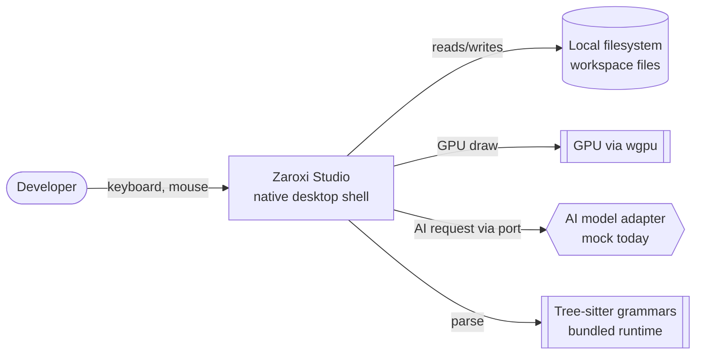

# System Context

What Zaroxi Studio is, who uses it, and where its boundaries are. For the
internal structure, see [architecture.md](architecture.md).

## What it is

Zaroxi Studio is a desktop code editor and IDE runtime that renders its own UI on
the GPU and is designed around AI-assisted editing. It runs as a single native
process; there is no server component required to edit locally.

## Actors

| Actor | Interacts via | Purpose |
|---|---|---|
| **Developer (user)** | The desktop shell (`gui_shell`) | Edit files, navigate a workspace, use AI assistance |
| **Contributor** | The Cargo workspace + docs | Extend crates, add grammars, fix issues |
| **AI model / provider** | Application AI ports (adapter) | Answer requests from the intelligence layer (currently a mock adapter) |

## Context diagram

## External dependencies

- **Operating system / windowing** — via winit (X11/Wayland, macOS, Windows).
- **GPU** — via wgpu (Vulkan/Metal/DX/GL backends).
- **Local filesystem** — the workspace being edited.
- **Tree-sitter grammars** — compiled shared libraries loaded from a bundled
  per-platform runtime.
- **AI model provider** — reached through an application-defined port; the shipped
  adapter is a mock, so no network model is required to run.

## Boundaries

- **In scope:** local editing, GPU rendering, syntax highlighting, workspace
  navigation, and the AI-assist architecture.
- **Adapter boundary:** persistence, transport/RPC, and AI backends are reached
  through ports so implementations can be swapped.
- **Not in scope (today):** hosted/multi-user services, a production remote
  backend, and a shipped LSP client (see [roadmap.md](roadmap.md)).

## Platforms

Linux, macOS, and Windows are built and tested in CI. Linux is the most
battle-tested; see [testing-and-quality.md](testing-and-quality.md) for platform
notes.
